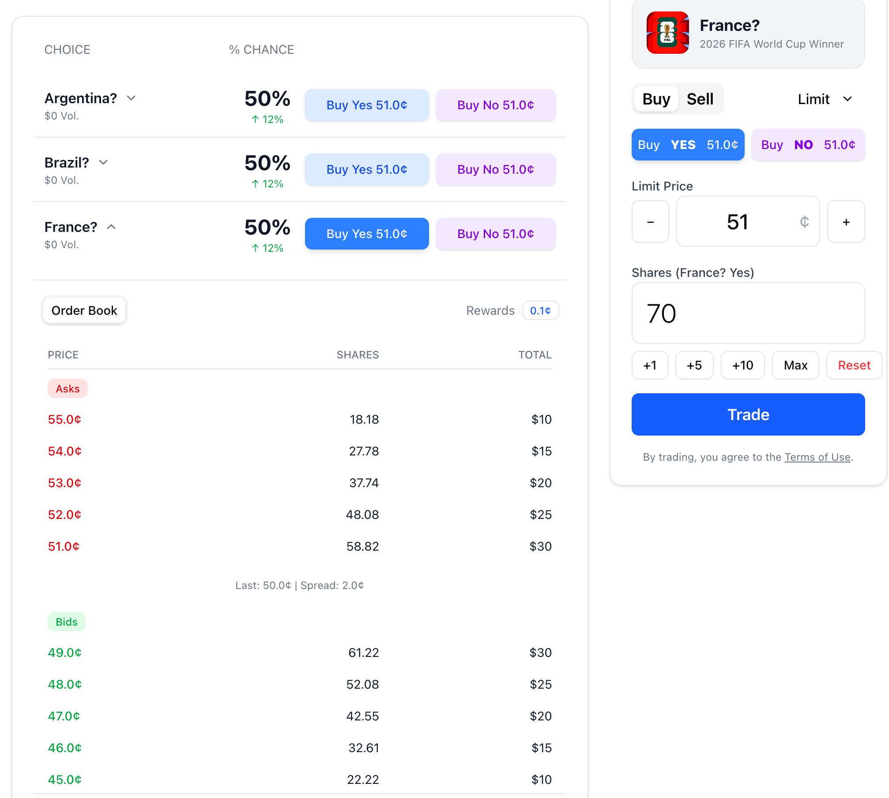

Written on Tue Nov 25 14:07:53 KST 2025

# Summary
This is the list of additional tasks in response to your latest implementation of the detail page. Your workspace should be in the `/Users/jay/work/nostra-server`, `/Users/jay/work/nostra-contracts`, and `/Users/jay/work/task` folders. You don't need to check the folder `/Users/jay/work/web` that you acutally have to avoid.

# Heads-Up
It's just asking for some knowledge about general development. So do nor change the code without my permission.

# Tasks 
## Task-1: Limit Order does not work
This is happening when a user places a limit order buying 70 amount of France 51c Yes Token.
Trading: 
Trading Result: 

51c bid part of result screen shot means that the limit order does not work. I think buying action should remove the 51c asks and list the remaining asks as bids.

And the following error occurs:
📤 Executing automatic match against DB order...
⚠️  Auto-matching failed (order still saved): execution reverted (unknown custom error) (action="estimateGas", data="0x7f9a6f46", reason=null, transaction={ "data": "0xe60f0c05000000000000000000000000000000000000000000000000000000000000008000000000000000000000000000000000000000000000000000000000000002a00000000000000000000000000000000000000000000000000000000001c9c38000000000000000000000000000000000000000000000000000000000000005000000000000000000000000000000000000000000000000000000019b017407c30000000000000000000000002572f01f04f6f32d658f257f433a4673cbd12c850000000000000000000000002572f01f04f6f32d658f257f433a4673cbd12c850000000000000000000000000000000000000000000000000000000000000000c53cb80ac0a3e7782379b1297b33e6fafb96254e0d288bacbabdc7907b828cf8000000000000000000000000000000000000000000000000000000000220bd2000000000000000000000000000000000000000000000000000000000042c1d80000000000000000000000000000000000000000000000000000000006940e584000000000000000000000000000000000000000000000000000000000000000000000000000000000000000000000000000000000000000000000000000000000000000000000000000000000000000000000000000000000000000000000000000000000000000000000000000000000000000000000000000000000000000000000000000000000000000000000000000000000000000000000000000001a000000000000000000000000000000000000000000000000000000000000000418d178af45f6c07a03af8b1c261d6b4ab4096236cdb040eaafff4698fee59ff012ad334ad7b75ce7184caf41273a667cbb6e08828924c54cbe769e4fbbda2698c1b0000000000000000000000000000000000000000000000000000000000000000000000000000000000000000000000000000000000000000000000000000010000000000000000000000000000000000000000000000000000000000000020000000000000000000000000000000000000000000000000187f6c95d9046a93000000000000000000000000440d17f23a9e6983a7447c4a9b06109bb0aaa8be000000000000000000000000440d17f23a9e6983a7447c4a9b06109bb0aaa8be0000000000000000000000000000000000000000000000000000000000000000c53cb80ac0a3e7782379b1297b33e6fafb96254e0d288bacbabdc7907b828cf800000000000000000000000000000000000000000000000000000000038193690000000000000000000000000000000000000000000000000000000001c9c38000000000000000000000000000000000000000000000000000000000695f1cc9000000000000000000000000000000000000000000000000000000000000000000000000000000000000000000000000000000000000000000000000000000000000000000000000000000000000000000000000000000000000000000000001000000000000000000000000000000000000000000000000000000000000000000000000000000000000000000000000000000000000000000000000000001a0000000000000000000000000000000000000000000000000000000000000004132cf2b9a5798a2456d1abb77e12bb891f5c9430bf545e6edf314e2d401e9eb750a3222a2882dbebac3fb21f713b26f1992e85b099d991d3e3c0395388a86e06f1b0000000000000000000000000000000000000000000000000000000000000000000000000000000000000000000000000000000000000000000000000000010000000000000000000000000000000000000000000000000000000003819369", "from": "0x440d17f23A9e6983a7447C4A9b06109bb0aAA8bE", "to": "0x514208e0877665a713D06fB4AF2F7a069702EF84" }, invocation=null, revert=null, code=CALL_EXCEPTION, version=6.15.0)
📋 Fetching maker orders for outcome: 71fec756-4fdf-4b1f-827b-cee348afee8f
   Liquidity Mode: ACTIVE_ORDERS
   Using database orders (ACTIVE_ORDERS)
✅ Returning 6 buy orders and 5 sell orders for outcome 71fec756-4fdf-4b1f-827b-cee348afee8f

# After Tasks Done
If we just discussing what to do for some change not going to implement it, you should summarize your recommendation for implementation and how to implement it into some document within /Users/jay/work/task/nostra/designs that could be created with current date not replacing the existing file. I thin html is more readable than markdown.

You should copy this md file to /Users/jay/work/task/nostra/old-tasks folder with current date and order number like 01 or something not replacing the existing file.

You can summarize the what you've done and the changes you've made to the codebase in the file named `summary.md` in the same folder as the tasks.md And copy it to the foler `~/work/task/nostra/dev-logs` with the name of summary-xxx.md in which xxx is date and time when the summary was created. If there is already the same file, you can add some number to the file name. In the last part of the file you should add the original request of the tasks described in this file with some vivid separation. I don't think you must change the codebase, but you can just plan the implementation or recommend something after a review and research. Any summary is OK because I can try to have you do something after a review.

Go ahead and thanks in advance!