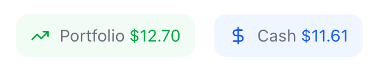
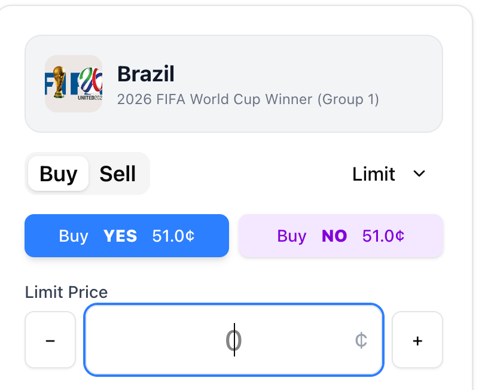

# Summary of Changes - Hybrid Resolution & My Positions

**Date**: November 21, 2025
**Time**: 15:45 KST

## 🚀 Key Implementations

### 1. Hybrid Market Resolution (Option 3)
Implemented a robust hybrid resolution system where:
- **Server** marks the market as resolved and reports payouts on-chain (`ConditionalTokens.reportPayouts`).
- **Users** claim their winnings directly from the blockchain via the frontend (`ConditionalTokens.redeemPositions`).

**Backend Changes**:
- Updated `POST /api/admin/resolve` to interact with the blockchain.
- Created `POST /api/redemption/claim` to prepare redemption transaction data for users.
- Created `GET /api/redemption/positions/:userAddress` to fetch all user positions efficiently.

**Frontend Changes**:
- Created **"My Positions"** page (`/my-positions`) to view active/resolved positions.
- Added **"Claim Winnings"** button that executes the redemption transaction.
- Updated **Header** to link to "My Positions".

### 2. Development Workflow
- Added `yarn fresh-start` command to `api/package.json` which combines:
  - Database reset
  - Schema push
  - Market creation
  - Token provisioning

## 📋 How to Test

### 1. Reset Everything
```bash
cd api
yarn fresh-start
```

### 2. Trade & Resolve
1. Go to `http://localhost:4000` and buy some shares (e.g., Brazil YES).
2. Go to the market page as Admin.
3. Click **"Finalize Market"** and select the winner.
   - This will now call `reportPayouts` on-chain.

### 3. Claim Winnings
1. Go to **"My Positions"** (link in header).
2. You should see your resolved position with a **"Claim Winnings"** button.
3. Click it to redeem your tokens for USDC.

---

# Original Request

# Task-1: Implement Option 3 Hybrid
For this question
```
Option 1: Server redeems tokens automatically (complex, requires approvals)
Option 2: Users redeem tokens themselves (simpler, requires frontend UI)
Option 3: Hybrid - server marks resolved, users claim rewards

Full analysis saved to: 
/Users/jay/work/tasks/nostra/finalize-market-analysis.md

Would you like me to:

Implement proper blockchain-based resolution?
Create a redemption workflow?
Both?
```

I think Option 3 would be great as you recommended. I want both for the last question.

 
This two button is to go into the Portfolio page. I don't the the name Portfolio is good or not. You can find the proper name for that, which I will use for stakeholders when presenting the project.

The portfolio is for the page where user see his portfolio. The portfolio should show the current market prices and the resolved payout values. The resolved payout values are calculated based on the resolved outcome and the current market prices.

User will can claim the payout by clicking the "Claim" button. The claim function will call the resolve API endpoint to properly resolve the market and distribute payouts.

The Portfolio page would be like this:
*   **`result:world-cup` Script:** The `participant-status.ts` script requires a minor adjustment to correctly calculate participant values for resolved markets using the $1.00 payout value.
*   **Oracle Mismatch (FIXED):** The `MarketFactory` had an incorrect oracle address, preventing the Server Wallet from resolving markets. I updated the oracle to the Server Wallet address. **User must run `yarn fresh-start` to recreate markets with the correct oracle.**

**Next Steps:**

1.  **Run `yarn fresh-start`:** This is required to recreate markets with the correct Oracle configuration.
2.  **Restart API Server:** Ensure the server picks up the clean state.
3.  **Execute Test Plan:** Buy tokens, resolve a market, and claim winnings to verify the full flow.
4.  **Update `participant-status.ts`:** Modify the script to correctly calculate participant values for resolved markets.


But I don't know the name of the page which you should recommend me.

# Task-2: Merge db:reset-all and provision:all scripts
I should these two scripts continuously before the trading feautre is beyond some stable state which means trading and resultion and results are all working.
