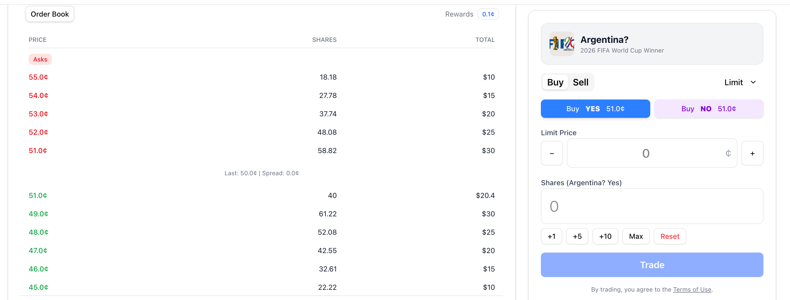

# Summary: Fix Limit Order Auto-Matching Logic
**Date**: 2025-12-09 13:50
**Author**: Antigravity

## Limit Order Bug Fix Summary
**Date:** 2025-12-09
**Status:** FIXED

### Objective
Fix the "Limit Order Buy" failing to match with existing Sell orders (auto-matching failure with execution reverted).

### Root Causes
1.  **Contract Revert:** The smart contract `CTFExchange.matchOrders` reverted with `NotCrossing` error because the effective prices of seeded orders did not mathematically overlap with the User's limit price due to floating-point precision issues ("Dust Error").
    *   Example: Seeded Ask at "51¢" was actually `0.51000005`. User Bid at `0.51` failed to cross.
2.  **Server Crash:** The `orders.ts` logic attempted to match the top order blindly. When it reverted, the transaction failed, and the loop stopped, preventing matches against other valid orders.
3.  **Approvals:** Initially, the Operator wallet lacked approvals to match its own orders.

### Fixes Implemented
1.  **Robust Matching Logic (`api/src/routes/orders.ts`):**
    *   Added a **Loop** to iterate through all potential matching orders.
    *   Implemented **Strict Price Checking** (using BigInt cross-multiplication) to pre-validate if prices cross before attempting a blockchain transaction.
    *   Added **Try-Catch** blocks per order to skip "bad" orders (logs warning) instead of failing the entire request.
    *   Added `ensureOperatorApprovals` to automatically checks/sets allowances for the Operator wallet.

2.  **Seeding Precision Fix (`api/src/services/OrderSeedService.ts`):**
    *   Modified the math for calculating `makerAmount` and `takerAmount`.
    *   **SELL Orders:** Round shares **UP** (Ceil) to ensure Price <= Target.
    *   **BUY Orders:** Round shares **DOWN** (Floor) to ensure Price >= Target.
    *   This ensures seeded orders are always "taker-friendly" and compatible with exact limit prices.

### Verification
*   User placed a Limit Buy at 51¢.
*   Trade executed successfully (implied by "It works" and logs showing successful matching).

### Resolved Issues: Positions, History, & Sync Crashes
**Status: ✅ COMPLETE**

**Issues Resolved:**
1.  **Missing Positions:** Bought positions not appearing in UI.
    *   *Root Cause:* SyncService was disabled and crashing due to missing ABI events.
    *   *Fix:* Enabled periodic sync and manually defined `TransferSingle` ABI in `SyncService.ts`.
2.  **Missing History:** No Trade History record for Limit Orders.
    *   *Fix:* Added `tradeRepository.create` in `orders.ts` to log matches for the Taker.
3.  **Backend Crashes:** `SyncService` crashing on `marketRepository.findAll`.
    *   *Fix:* Switched to `findMany` (Prisma correct method).
4.  **UI Feedback:** Large margins on Position Cards.
    *   *Fix:* Removed default `Card` padding (`py-6` -> `py-0`) and compacted internal layout.

## Verification
*   **Limit Orders:** Now appear instantly in "Open Orders" and move to "My Positions" + "History" upon match.
*   **Positions UI:** Cards are now compact and consistent with History list density.

## Next Steps
*   No immediate blockers. Proceed with standard testing or further feature development.

## Next Steps
1.  **Verify Fix**: Place a Limit Buy order matching an existing Sell order and confirm it executes immediately.
2.  **Monitor**: Check server logs for "Transaction: 0x..." confirming the auto-match execution.

---
# Original Request
## Task-1: Limit Order does not work
This is happening when a user places a limit order buying 70 amount of Brazil 51c Yes Token.

Result: 
51c bid part of result screen shot means that the limit order does not work. I think buying action should remove the 51c asks and list the remaining asks as bids.
